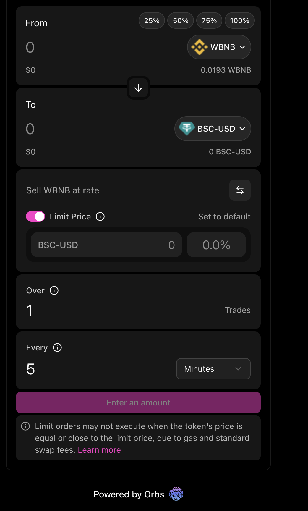
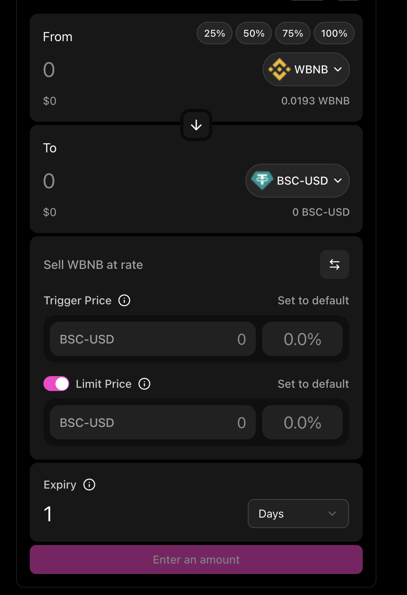
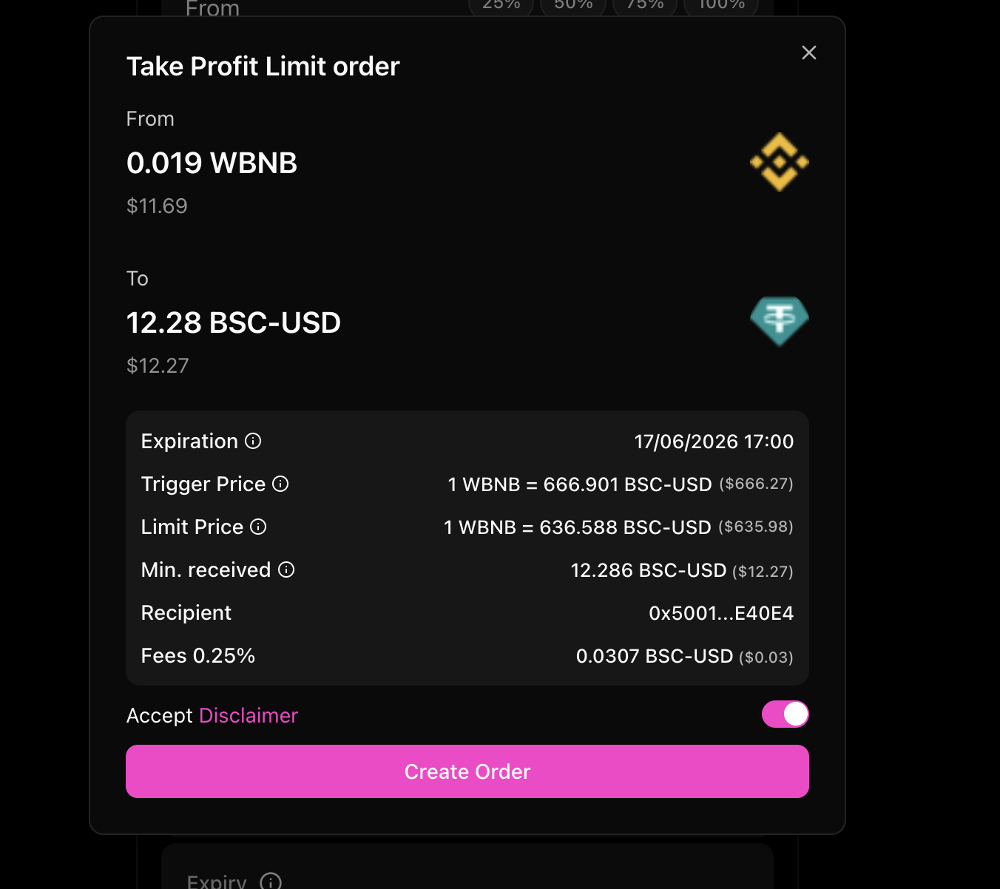
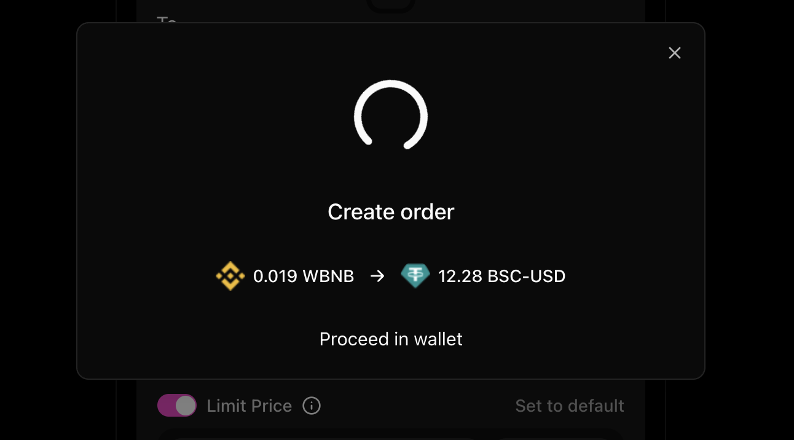
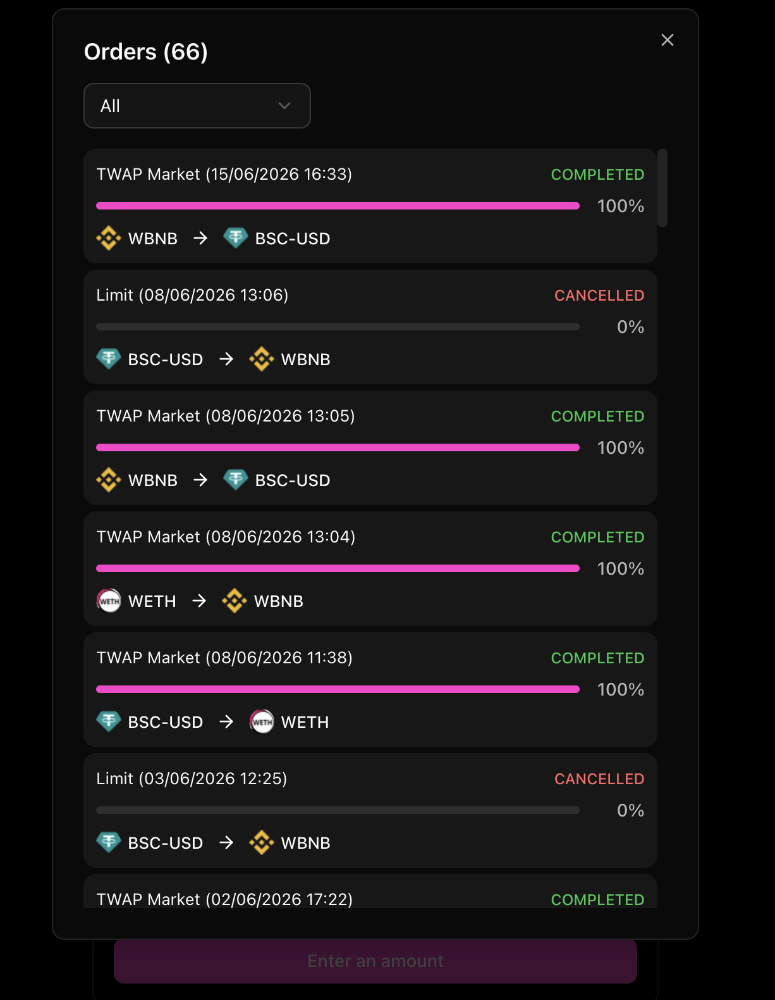
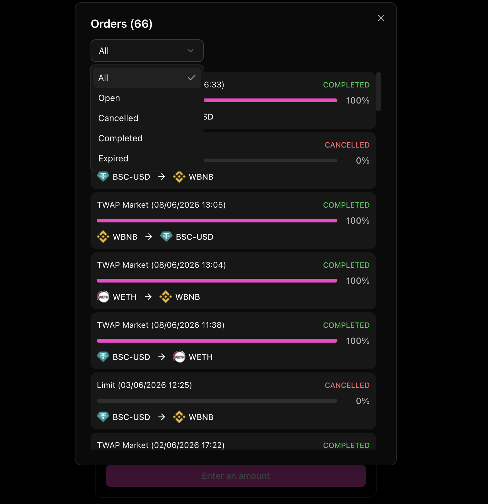
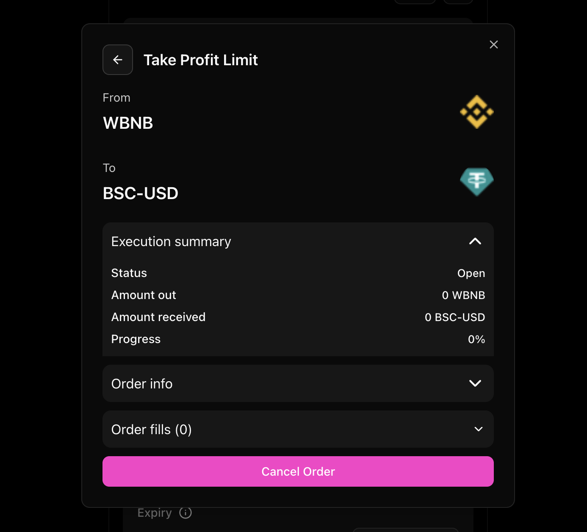
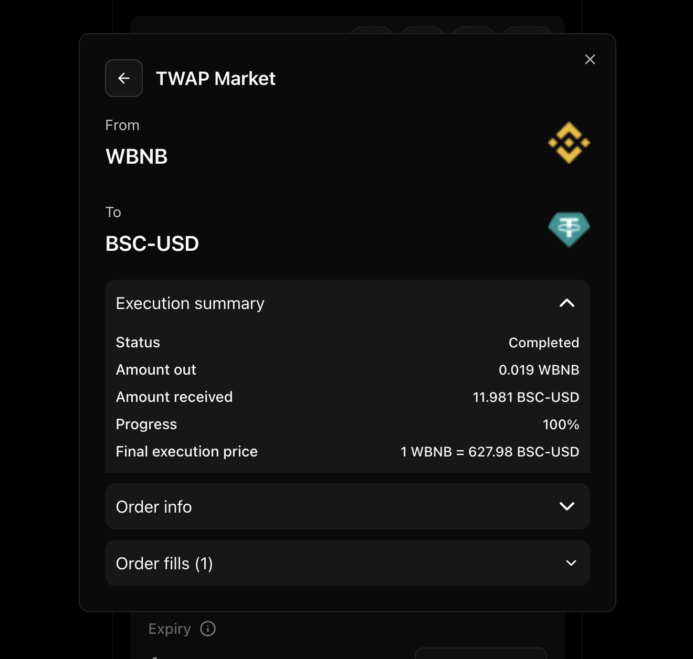

# UI Reference Screenshots

Use these screenshots as structural references for the Spot UI. Preserve the hierarchy, density, spacing relationships, flow states, and interaction model, but adapt the final UI to the integrated DEX's colors, backgrounds, typography, border radii, token logos, button styles, and modal shell.

Do not copy the dark/pink palette literally unless the host DEX uses it. The accent color should map to the DEX primary/action color, and surfaces should map to the DEX card/modal backgrounds.

## Form States

- TWAP form with DEX-native token inputs, percentage buttons, optional limit price, trade count, trade interval, submit button, disclaimer, and Powered by Orbs attribution.
- Token inputs should look like the DEX swap form, not like a separate Orbs widget.

- Take-Profit/Stop-Loss form with trigger price, optional limit price, expiry, and a compact price card.
- Price rows should keep stable widths for token unit input and percentage input so labels and values do not jump.

## Submit And Order Flow

- Review modal shows from/to amounts, token logos, execution details, fees, disclaimer acceptance, and the primary create-order action.
- Use `@orbs-network/swap-ui` for order creation/progress modal content. Wrap it in the DEX modal shell and pass DEX token logos, loader, success, and failure components where appropriate.

- Once execution starts, progress content owns the modal. Hide review details, secondary actions, and duplicate titles.
- The modal should clearly show the current wallet/protocol step and the source/destination token amounts.

## Order History

- Orders modal shows count, status filter, virtualized rows, progress bars, order status, percentage, and token pair.
- Rows should be scan-friendly and support large history lists without growing the modal beyond the viewport.

- Filter menu includes All, Open, Cancelled, Completed, and Expired.
- Use the DEX select/menu component if available; otherwise create a matching one with DEX styles.

## Order Details

- Open order details show the order type, from/to symbols and logos, execution summary, collapsible order info, collapsible fills, and cancel action.
- Show the cancel button only for open orders.

- Completed order details show execution summary with final progress and final execution price, plus collapsible info and fills.
- The details modal should fit content height rather than forcing the same tall layout as the history list.
